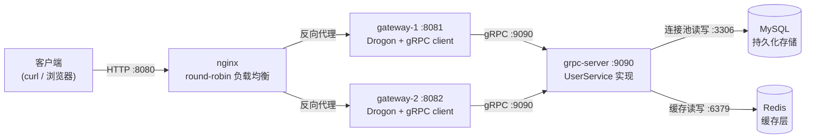

# http_server_demo

基于 **nginx + gRPC + MySQL + Redis** 的 C++ 分层微服务 HTTP 后端 demo。

- **nginx**：HTTP 入口，`upstream` 轮询负载均衡
- **gateway（HTTP 网关，可多实例）**：Drogon 框架，对外暴露 REST API
- **grpc-server（业务服务）**：gRPC 实现 `UserService`
- **MySQL**：持久化存储（**连接池**管理连接）
- **Redis**：**缓存层**（Cache-Aside 模式）

## 架构



调用链：`curl :8080` → nginx 轮询选中一个 gateway → gateway 经 gRPC 调 grpc-server → grpc-server **先查 Redis 缓存，未命中再查 MySQL 并回填** → 逐层返回。

> 每个 HTTP 响应都带 `X-Gateway-Instance` 头，标识实际处理请求的 gateway 实例，用来肉眼观察负载均衡轮询效果。

## 技术栈

| 层 | 选型 |
|---|---|
| 语言 | C++17 |
| 构建 | CMake |
| HTTP 网关 | Drogon 1.9 |
| RPC | gRPC C++（brew 安装）+ protobuf |
| 持久化存储 | MySQL + libmysqlclient（官方 C API） |
| 数据库连接池 | 自研 `MysqlPool`（固定大小 + 互斥空闲队列） |
| 缓存 | hiredis（RAII 封装） + Redis |
| JSON | nlohmann/json |
| 负载均衡 | nginx |

## 目录结构

```
http_server_demo/
├── CMakeLists.txt            # 构建配置
├── Makefile                  # 常用命令封装
├── proto/user/v1/user.proto  # gRPC 契约
├── generated/                # protoc 生成代码（已提交）
├── deploy/nginx/nginx.conf   # 负载均衡配置
├── src/
│   ├── common/               # 参数解析、JSON 工具
│   ├── store/
│   │   ├── mysql_pool.*      # MySQL 连接池（RAII 连接/结果集 + 空闲队列）
│   │   ├── user_repository.* # 数据访问层：MySQL 持久化 + Redis 缓存
│   │   └── redis_client.*    # hiredis RAII 封装（缓存客户端）
│   ├── grpc_server/          # UserService 实现 + 服务入口
│   └── gateway/              # Drogon 控制器 + gRPC client + 入口
└── build/                    # 构建产物（gitignore）
```

## 环境要求

macOS + Homebrew：

```bash
brew install protobuf grpc pkg-config hiredis nlohmann-json redis nginx drogon mysql
```

启动 MySQL 与 Redis：

```bash
brew services start mysql    # 或 mysql.server start
redis-server                 # 另开终端
```

> 默认连接参数：MySQL `root@127.0.0.1:3306` 空密码（brew 默认）、库 `http_server_demo`，均可用 `grpc-server` 的命令行参数覆盖。
> 建库建表由程序启动时自动完成，无需手动执行 SQL。

## 快速开始

### 1. 编译

```bash
make build
```

### 2. 启动服务（按顺序，各开一个终端）

```bash
# 终端 A：Redis
redis-server

# 终端 B：gRPC 业务服务（自动建库建表 + 初始化 MySQL 连接池）
make run-grpc

# 终端 C/D：两个 HTTP 网关实例
make run-gateway-1
make run-gateway-2

# 终端 E：nginx 负载均衡入口
make run-nginx
```

`grpc-server` 支持参数覆盖（示例）：

```bash
./build/grpc_server \
  --mysql-host=127.0.0.1 --mysql-port=3306 \
  --mysql-user=root --mysql-password= --mysql-pool-size=8
```

### 3. 端到端演示

```bash
# 创建用户
curl -s -X POST http://127.0.0.1:8080/api/v1/users \
     -H 'Content-Type: application/json' \
     -d '{"name":"tom","email":"tom@example.com"}'

# 查询（先查 Redis 缓存，未命中回源 MySQL 并回填）
curl -s http://127.0.0.1:8080/api/v1/users/1

# 用户列表 / 统计
curl -s 'http://127.0.0.1:8080/api/v1/users?limit=10&offset=0'
curl -s http://127.0.0.1:8080/api/v1/stats

# 观察负载均衡轮询：连续请求看 X-Gateway-Instance 头切换
for i in $(seq 1 8); do curl -s -i http://127.0.0.1:8080/healthz | grep -i x-gateway-instance; done

# 一行搞定全部
make test
```

验证缓存回源行为：

```bash
redis-cli del user:1        # 删除缓存模拟未命中
curl -s http://127.0.0.1:8080/api/v1/users/1   # 命中 MySQL 并回填缓存
redis-cli get user:1        # 可见缓存已回填
mysql -uroot -e 'SELECT * FROM http_server_demo.users;'  # 持久化数据
```

### 4. 停止

```bash
make stop-nginx
# 其余进程在各自终端 Ctrl+C
```

## 数据存储设计

### MySQL（持久层）

启动时自动执行（`IF NOT EXISTS`，幂等）：

```sql
CREATE DATABASE IF NOT EXISTS http_server_demo DEFAULT CHARSET utf8mb4;
CREATE TABLE IF NOT EXISTS users (
  id BIGINT AUTO_INCREMENT PRIMARY KEY,   -- 自增主键 -> 用户 ID
  name VARCHAR(128) NOT NULL,
  email VARCHAR(256) NOT NULL,
  created_at BIGINT NOT NULL
) ENGINE=InnoDB DEFAULT CHARSET=utf8mb4;
```

所有用户数据**只存 MySQL**，Redis 宕机不影响数据完整性。

### MySQL 连接池（`MysqlPool`）

- 固定大小（默认 8）`MYSQL*` 连接，程序启动时建好。
- `acquire()` 从空闲队列取连接，`Guard`（RAII）析构自动归还，池空时阻塞等待。
- 解决单连接下的线程安全问题与反复建连开销；`MysqlResult` 保证结果集自动释放。

### Redis（缓存层，Cache-Aside）

| Key | 缓存内容 | TTL | 写时处理 |
|---|---|---|---|
| `user:{id}` | 用户 JSON | 60s | Create 时主动写入；未命中回源 MySQL 后回填 |
| `users:list:{limit}:{offset}` | 列表 JSON | 10s | Create 时按索引批量失效 |
| `stats:total_users` | `COUNT(*)` 结果 | 30s | Create 时删除 |
| `stats:request_count` | 请求计数 | 无 | 每次业务 RPC `INCR` |

> 失效策略：Create 后写 `user:{id}` 缓存，同时失效列表/统计缓存，保证**写后读到的都是新数据**。

## REST API

| Method | Path | 说明 |
|---|---|---|
| POST | `/api/v1/users` | 创建用户，body `{"name": "...", "email": "..."}` |
| GET | `/api/v1/users/{id}` | 按 ID 查询用户（缓存优先） |
| GET | `/api/v1/users?limit=&offset=` | 分页列出用户 |
| GET | `/api/v1/stats` | 统计：用户总数 + 请求计数 |
| GET | `/healthz` | 健康检查，返回 `{"status":"ok","instance":"gateway-x"}` |

所有响应均为 JSON，并带 `X-Gateway-Instance` 头。

## 常见问题

- **`grpc-server` 报 MySQL 连接失败**：先启动 MySQL（`brew services start mysql`），确认账号密码可用 `mysql -uroot`。
- **`grpc-server` 报 Redis 连接失败**：先启动 `redis-server`。
- **protobuf/gRPC 版本错配报错**：`brew upgrade grpc` 对齐版本后 `make proto && make build`。
- **端口被占用**：确认 mysql(3306)、redis(6379)、grpc(9090)、gateway(8081/8082)、nginx(8080) 未被占用。
- **修改 proto 后代码没变**：`make proto` 重新生成，再 `make build`。
- **nginx 启动失败**：查看 `deploy/nginx/logs/error.log`。

详细原理与踩坑记录见 **[NOTES.md](./NOTES.md)**。
