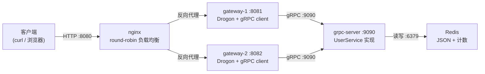

# http_server_demo

基于 **nginx + gRPC + Redis** 的 C++ 分层微服务 HTTP 后端 demo。

- **nginx**：HTTP 入口，`upstream` 轮询负载均衡
- **gateway（HTTP 网关，可多实例）**：Drogon 框架，对外暴露 REST API
- **grpc-server（业务服务）**：gRPC 实现 `UserService`，读写 Redis
- **Redis**：用户数据存储 + 访问计数

## 架构



调用链：`curl :8080` → nginx 轮询选中一个 gateway → gateway 经 gRPC 调 grpc-server → grpc-server 读写 Redis → 逐层返回。

> 每个 HTTP 响应都带 `X-Gateway-Instance` 头，标识实际处理请求的 gateway 实例，用来肉眼观察负载均衡轮询效果。

## 技术栈

| 层 | 选型 |
|---|---|
| 语言 | C++17 |
| 构建 | CMake |
| HTTP 网关 | Drogon 1.9 |
| RPC | gRPC C++（brew 安装）+ protobuf |
| 存储客户端 | hiredis（RAII 封装） |
| JSON | nlohmann/json |
| 负载均衡 | nginx |
| 存储 | Redis |

## 目录结构

```
http_server_demo/
├── CMakeLists.txt            # 构建配置
├── Makefile                  # 常用命令封装
├── proto/user/v1/user.proto  # gRPC 契约
├── generated/                # protoc 生成代码（已提交）
├── deploy/nginx/nginx.conf   # 负载均衡配置
├── src/
│   ├── common/               # 参数解析、JSON 工具
│   ├── store/                # hiredis RAII 封装
│   ├── grpc_server/          # UserService 实现 + 服务入口
│   └── gateway/              # Drogon 控制器 + gRPC client + 入口
└── build/                    # 构建产物（gitignore）
```

## 环境要求

macOS + Homebrew：

```bash
brew install protobuf grpc pkg-config hiredis nlohmann-json redis nginx drogon
```

> 本仓库 `generated/` 已提交生成代码，因此**只要不修改 proto，编译阶段不需要手动跑 protoc**；若修改了 `user.proto`，用 `make proto` 重新生成。

## 快速开始

### 1. 编译

```bash
make build
```

### 2. 启动服务（按顺序）

```bash
# 终端 A：Redis
redis-server

# 终端 B：gRPC 业务服务
make run-grpc

# 终端 C/D：两个 HTTP 网关实例
make run-gateway-1
make run-gateway-2

# 终端 E：nginx 负载均衡入口
make run-nginx
```

> 每个命令都应另开一个终端窗口（前台运行便于看日志）。也可以改为 `nohup ... &` 后台运行。

### 3. 端到端演示

```bash
# 创建两个用户
curl -s -X POST http://127.0.0.1:8080/api/v1/users \
     -H 'Content-Type: application/json' \
     -d '{"name":"tom","email":"tom@example.com"}'
curl -s -X POST http://127.0.0.1:8080/api/v1/users \
     -H 'Content-Type: application/json' \
     -d '{"name":"jerry","email":"jerry@example.com"}'

# 查询单个用户
curl -s http://127.0.0.1:8080/api/v1/users/u1

# 用户列表（分页）
curl -s 'http://127.0.0.1:8080/api/v1/users?limit=10&offset=0'

# 统计信息（用户数 / 请求计数）
curl -s http://127.0.0.1:8080/api/v1/stats

# 观察负载均衡轮询：连续请求，观察 X-Gateway-Instance 头在 gateway-1/gateway-2 间切换
for i in $(seq 1 8); do curl -s -i http://127.0.0.1:8080/healthz | grep -i x-gateway-instance; done

# 一行搞定全部
make test
```

> `make test` 需要所有服务已启动。

### 4. 停止

```bash
make stop-nginx
# 其余进程在各自终端 Ctrl+C 即可
```

## REST API

| Method | Path | 说明 |
|---|---|---|
| POST | `/api/v1/users` | 创建用户，body `{"name": "...", "email": "..."}` |
| GET | `/api/v1/users/{id}` | 按 ID 查询用户 |
| GET | `/api/v1/users?limit=&offset=` | 分页列出用户 |
| GET | `/api/v1/stats` | 统计：用户总数 + 请求计数 |
| GET | `/healthz` | 健康检查，返回 `{"status":"ok","instance":"gateway-x"}` |

所有响应均为 JSON，并带 `X-Gateway-Instance` 头。

## Redis 数据结构

| Key | 类型 | 说明 |
|---|---|---|
| `user:{id}` | String | 用户 JSON（主数据） |
| `users:ids` | Set | 全部用户 ID，供列表遍历 |
| `users:seq` | String(Int) | INCR 自增，用于生成用户 ID |
| `stats:request_count` | String(Int) | INCR 原子计数，每次业务 RPC +1 |

## 常见问题

- **端口被占用**：确认 redis(6379)、grpc(9090)、gateway(8081/8082)、nginx(8080) 未被占用。
- **grpc-server 报 Redis 连接失败**：先启动 `redis-server`。
- **修改 proto 后代码没变**：执行 `make proto` 重新生成，再 `make build`。
- **nginx 启动失败**：查看 `deploy/nginx/logs/error.log`。

详细原理与踩坑记录见 **[NOTES.md](./NOTES.md)**。
